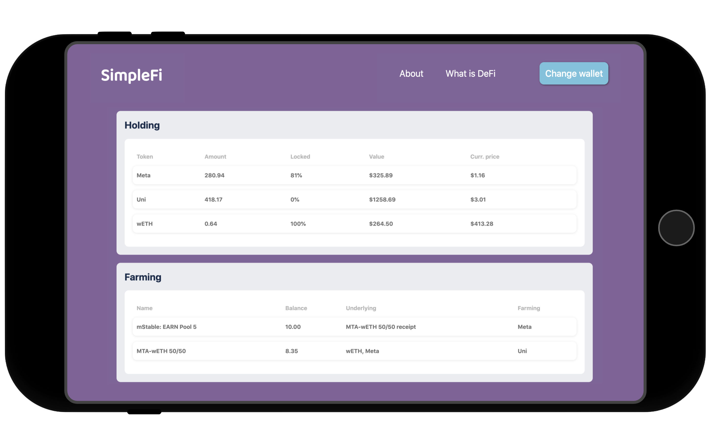

# SimpleFi
<p align="center">
  <br/>
  
</p>
<br/>
SimpleFi makes it easy to manage your decentralised finance investment portfolio.


## Screenshots

<p align="center">
  
  
</p>


## Getting started

1. Clone the repo

```
git https://github.com/raphael-mazet/SimpleFi.git
```

2. Create a .env file in the Prisma directory
```
DB_PORT=<yourport>
DB_USERNAME=<yourusername>
DB_PASSWORD=<yourpassword>
DB_HOST=<yourhost>
DB_NAME=<yourdbname>
DATABASE_URL = postgres://${DB_USERNAME}:${DB_PASSWORD}@${DB_HOST}:${DB_PORT}/${DB_NAME}
```

3. Start the backend server
```
cd server/
npm install
nodemon index.js
```

4. start the client server
```
cd client/
npm install
npm start
```


## Built with

* [Express](https://expressjs.com/) - fast, unopinionated, minimalist web framework for Node.js
* [React](https://reactjs.org/) - javaScript library for building user interfaces
* [PostgreSQL](https://www.postgresql.org/) - open source relational database
* [Prisma](https://www.prisma.io/) - open source database toolkit
* [ethers.js](https://docs.ethers.io/v5/) - lightweight javaScript library to interact with the Ethereum blockchain


## Contributing

Improvements and remixes are welcome.


## Author

Raphaël Mazet - [Github](https://github.com/raphael-mazet) - [LinkedIn](https://www.linkedin.com/in/raphael-mazet/)
